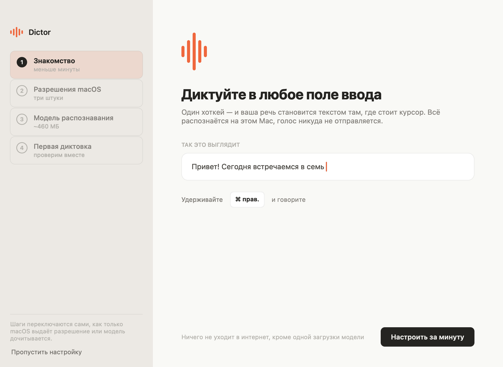

# Dictor

Локальная диктовка для macOS (Apple Silicon). Нажми хоткей — говори — текст
появляется там, где стоит курсор. Аудио и расшифровка не покидают Mac.

- Распознавание: Parakeet TDT v3 (CoreML, Apple Neural Engine) через FluidAudio
- Русский, английский и ещё ~17 языков; авто-определение
- История диктовок, статистика, словарь автозамен, удаление слов-паразитов
- Ни облака, ни телеметрии, ни аккаунтов
- Обновляется сам с собственного канала: архив проверяется по SHA-256 и по
  подписи, ставится в один клик


<details>
<summary>Ещё экраны</summary>

**История** — поиск по всему архиву, закрепление, копирование целиком или по
куску.


**Статистика** — периоды, календарь привычки, время суток, выгрузка в CSV.


**Настройки** — семь вкладок внутри окна.


**Словарь** — замены для имён и терминов, которые модель слышит не так.


**Знакомство** — четыре шага при первом запуске, с проверкой микрофона и полем
для пробы.



**Тёмная тема** — во всех разделах.


</details>

## Установка

Скачать образ с [dictor.raulgumerov.com](https://dictor.raulgumerov.com/) и
перетащить приложение в «Программы».

Приложение не нотаризовано (подпись самодельная), поэтому при первом запуске
macOS попросит подтвердить открытие: Системные настройки → «Конфиденциальность
и безопасность» → «Открыть всё равно». Об этом сказано прямо в окне образа.
Обновления это предупреждение не показывают — заменяется уже доверенный бандл.

**Запускать только из «Программ».** Открытое прямо с образа приложение macOS
выполняет из одноразовой копии по случайному пути (App Translocation): служба
пропишется на исчезающий путь, а разрешения достанутся копии-призраку. Dictor
это распознаёт и сам предлагает перенести себя, но проще сразу перетащить.

## Сборка

```bash
./scripts/build-app.sh        # → dist/Dictor.app (нужны только Xcode CLT)
./scripts/make-dmg.sh         # → dist/Dictor-<версия>.dmg, готовый к отправке
```

Перед коммитом:

```bash
./scripts/check.sh                          # проверки репозитория
swift build --package-path swift            # check.sh не компилирует
swift/.build/debug/Dictor --self-test all
```

`--self-test all` исполняет сценарии по-настоящему, включая скрипт подмены
бандла на временной копии. Экраны проверяются рендером, а не на глаз:

```bash
swift/.build/debug/Dictor --export-history-preview  <dir>   # окно, 6 разделов × 2 темы
swift/.build/debug/Dictor --export-settings-preview <dir>   # 7 вкладок × 2 темы
swift/.build/debug/Dictor --export-onboarding-preview <dir> # 4 шага × 2 темы
```

## Выпуск версии

```bash
./scripts/make-release.sh --notes "Что нового"
```

Версия берётся из `swift/Info.plist` — единственный источник правды, git-тег
ставится из неё же. Скрипт собирает приложение, образ и архив, проверяет
подпись архива тем же требованием, что и апдейтер, выкладывает на канал,
скачивает обратно и сверяет SHA-256. `--dry-run` собирает и останавливается.

Как устроены раздача и обновления — в [DISTRIBUTION.md](DISTRIBUTION.md).
История версий — в [CHANGELOG.md](CHANGELOG.md).

## Лицензия

Личный проект. Использует открытый код по лицензии MIT — атрибуция апстрима
в [LICENSE](LICENSE) и [NOTICE.md](NOTICE.md).
