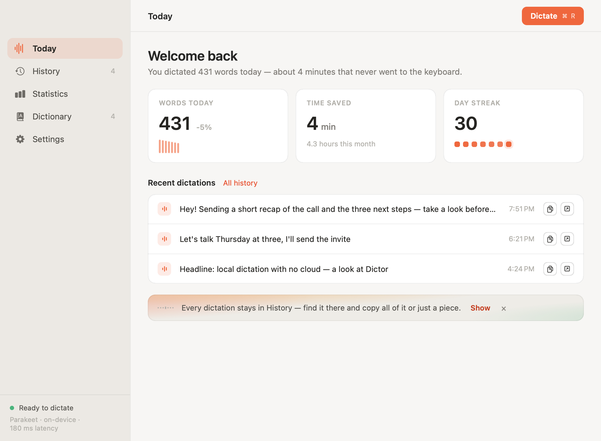
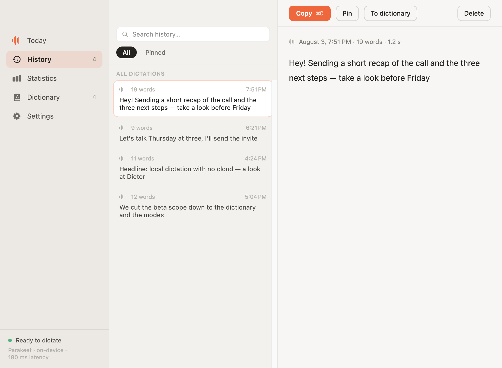
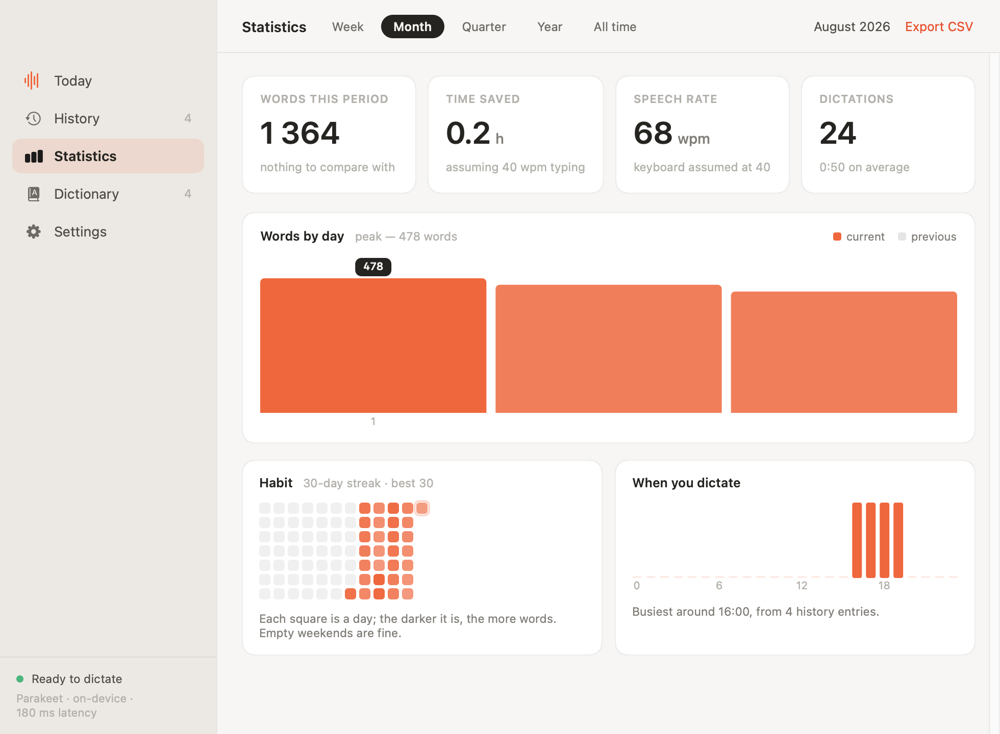
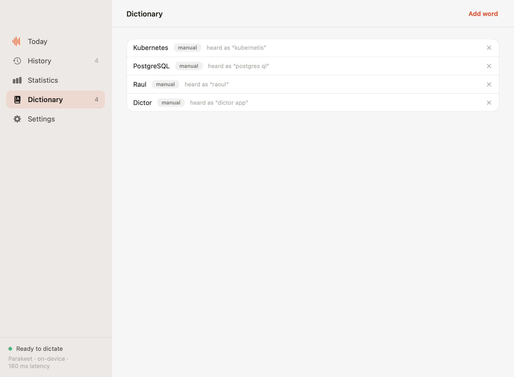
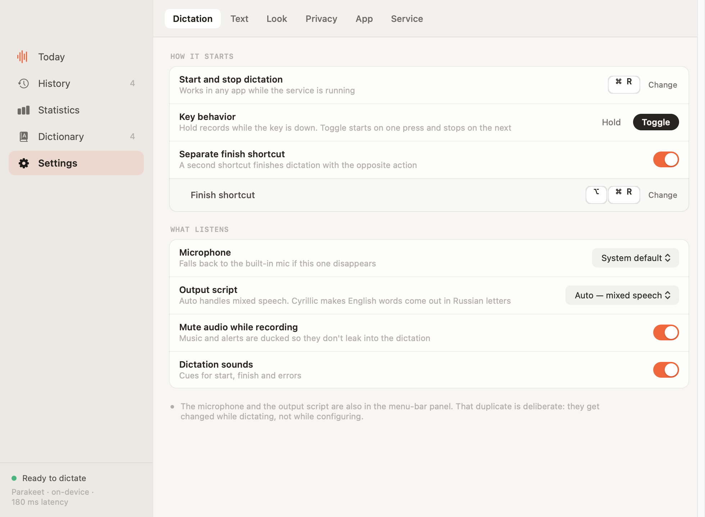
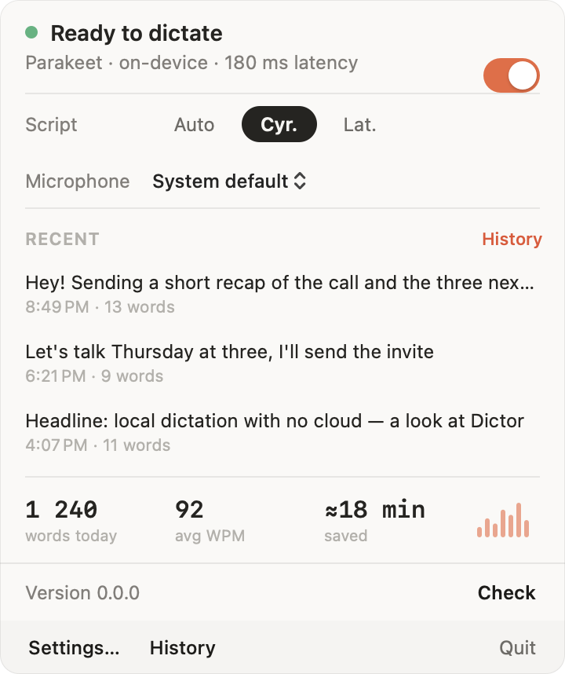
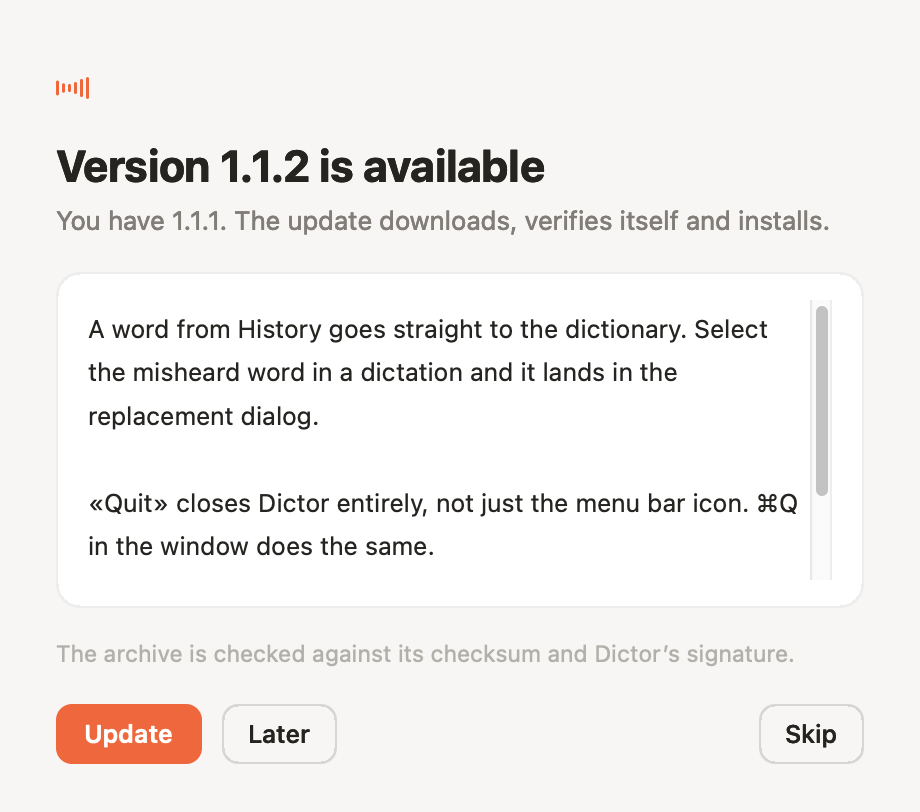
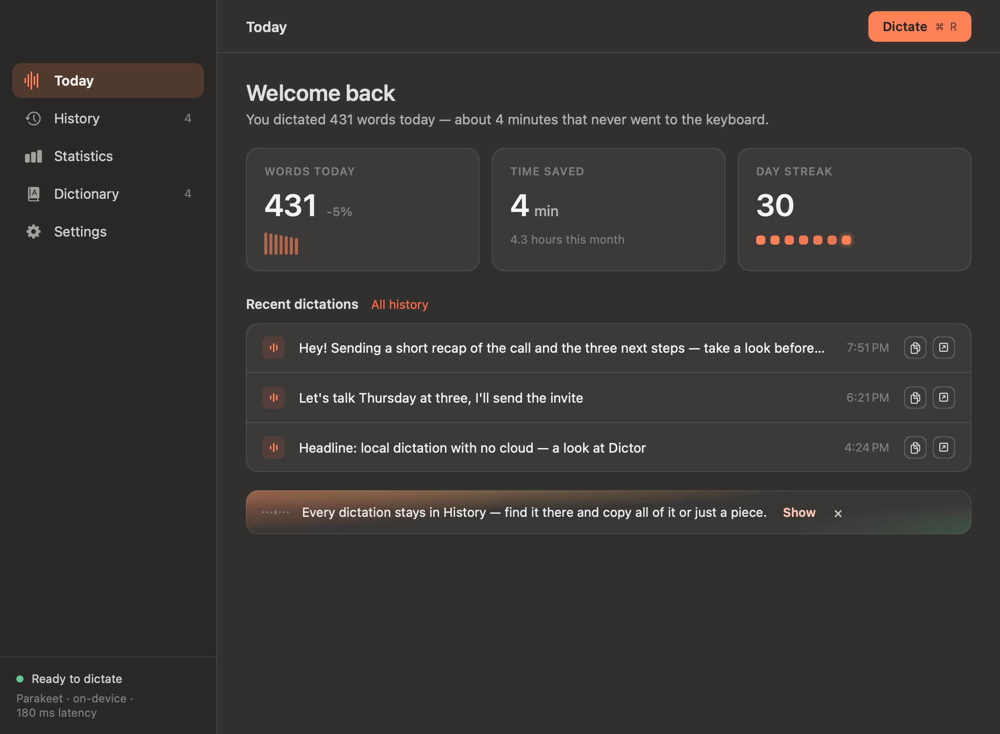

<div align="center">

# Dictor

**Push-to-talk dictation for macOS that never sends your voice anywhere.**

Hold a key, say what you mean, let go — the text appears where your cursor is.
Recognition runs on the Apple Neural Engine, on your Mac. No account, no
subscription, no cloud, works on a plane.

[](https://github.com/abra9987/Dictor/actions/workflows/build.yml)
[](https://dictor.raulgumerov.com/)


</div>

**Origin.** Dictor is a fork of [Parakey](https://github.com/rcourtman/parakey)
by Richard Courtman, MIT licensed, which got the core right: push-to-talk
dictation recognised entirely on the machine. That base is imported here as a
single commit, and the copyright notice it carries is preserved in
[LICENSE](LICENSE) and [NOTICE.md](NOTICE.md). Everything after it — the
interface and its design system, the background service, history, statistics,
the vocabulary, the update channel — was written for Dictor by one author, from
23 July 2026 onward.

## Why

Dictation apps ask you to trust a company with your voice. Most upload every
recording to a server, charge monthly, and stop working without a connection —
for something your Mac has the hardware to do by itself.

Dictor does it on the machine. The audio never leaves it, and is deleted the
moment the text exists. The internet is needed twice: once to download the
speech model, and every six hours to ask a single number — whether a newer
version exists. Turn that off and the app makes no network calls at all.

|  | Dictor | Cloud dictation | Built-in macOS dictation |
|---|---|---|---|
| Audio leaves the Mac | never | every recording | for some languages |
| Works offline | yes | no | limited |
| Cost | none | monthly | none |
| Searchable history | 10 000 dictations | varies | none |
| Custom vocabulary | yes | usually | no |
| Russian + English + 16 more | yes | yes | yes |

## What it looks like

**Today** — the day at a glance, and the last few dictations.



<details>
<summary><b>More screens</b></summary>

**History** — every dictation, searchable. Select a piece and copy it, pin the
ones you keep coming back to, or send a misheard word straight to the
dictionary.



**Statistics** — words spoken, time saved, a habit calendar, time-of-day
patterns, quarters and years. Exports to CSV. No targets, no streak-shaming.



**Dictionary** — replacements for names and terms the model keeps mishearing.



**Settings** — six tabs inside the window, no separate preferences panel.



**The menu-bar panel** — service toggle, language, microphone, recent
dictations, today's numbers.



**Updates** — the app tells you itself, in its own window, and installs on one
click after checking the archive against its checksum and signature.



**Dark theme** — everywhere.



</details>

## Features

- **One key, any app.** Hold the shortcut in a message, an email, a code
  editor — the text lands at the cursor. Press-and-hold or toggle, your choice.
- **On-device recognition.** NVIDIA Parakeet TDT v3 through CoreML on the Apple
  Neural Engine: about half a second of processing for half a minute of speech.
- **Russian and English out of the box**, plus 16 more, with automatic language
  detection.
- **A history that answers "what did I say?"** — up to 10 000 dictations,
  searchable, with the matches highlighted.
- **A personal dictionary** — fix a word the model mishears once, and it stays
  fixed. Add words straight from your own transcripts.
- **Filler word removal** — "uh", "um" and friends never reach the text.
- **Statistics that inform rather than nag.**
- **Updates itself** from its own channel, verifying the download by SHA-256 and
  by code signature before replacing anything.

## Install

Download the disk image from **[dictor.raulgumerov.com](https://dictor.raulgumerov.com/)**
and drag Dictor into Applications.

> **Open it from Applications, not from the disk image.** macOS runs a
> quarantined app straight from a `.dmg` out of a read-only throwaway copy, and
> permissions granted to that copy vanish with it. Dictor detects this and
> offers to move itself, but dragging it first is simpler.

The app is signed but not notarised, so on first launch macOS will say it
cannot verify the developer: **System Settings → Privacy & Security → Open
Anyway**. Updates never show that warning, since they replace an app the system
already trusts.

Requires macOS 14 and Apple Silicon.

## Privacy

- Audio lives on disk only as a crash-recovery journal while a dictation is
  being handled, and is deleted as soon as the text exists. After a failure the
  journal stays so the next launch can recover the dictation into History.
- Transcripts and statistics stay on your Mac, in your user library.
- No accounts, no analytics, no crash reporting, no identifiers of any kind.
- Network destinations are two: `huggingface.co`, where the speech model comes
  from (once — and again only if the cached files fail their integrity check),
  and the update channel, which answers with a version number and, during an
  update, the archive. The update check sends a fixed user agent and can be
  turned off.

## Build

Only the Xcode command-line tools are needed — no Xcode project, no
dependencies to install by hand.

```bash
./scripts/build-app.sh        # → dist/Dictor.app
./scripts/make-dmg.sh         # → dist/Dictor-<version>.dmg
```

Before a commit:

```bash
./scripts/check.sh                          # repository checks
swift build --package-path swift            # check.sh does not compile
swift/.build/debug/Dictor --self-test all
```

Screens are verified by rendering them, not by eye:

```bash
swift/.build/debug/Dictor --export-history-preview    <dir> [ru|en]
swift/.build/debug/Dictor --export-settings-preview   <dir>
swift/.build/debug/Dictor --export-onboarding-preview <dir>
swift/.build/debug/Dictor --export-update-preview     <dir> [ru|en]
swift/.build/debug/Dictor --export-popover-preview    <dir> [ru|en]
swift/.build/debug/Dictor --export-status-preview     <dir>
swift/.build/debug/Dictor --export-capsule-preview    <dir> [ru|en]
swift/.build/debug/Dictor --export-hud-animation      <dir> [ru|en]
```

Releases go out with `./scripts/make-release.sh --notes "…"`, which builds,
verifies the archive against the same signature requirement the updater
enforces, publishes it and tags the commit. See
[docs/updates.md](docs/updates.md) for how the update channel works, and
[CHANGELOG.md](CHANGELOG.md) for the version history.

## Credits

Built on the open-source project by Richard Courtman, MIT licensed. The
attribution lives in [LICENSE](LICENSE) and [NOTICE.md](NOTICE.md). Speech
recognition uses [FluidAudio](https://github.com/FluidInference/FluidAudio) and
NVIDIA's Parakeet TDT model.

Русская версия этого файла — [README.ru.md](README.ru.md).
