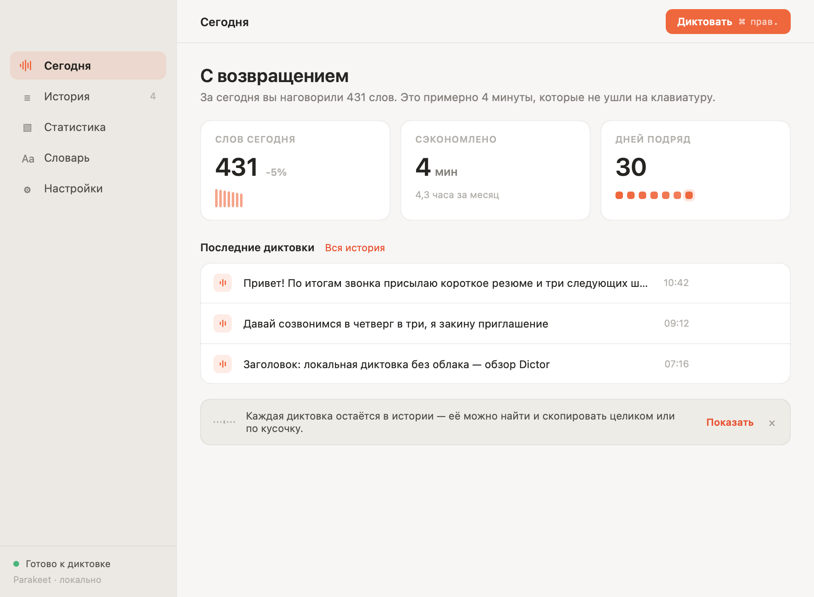
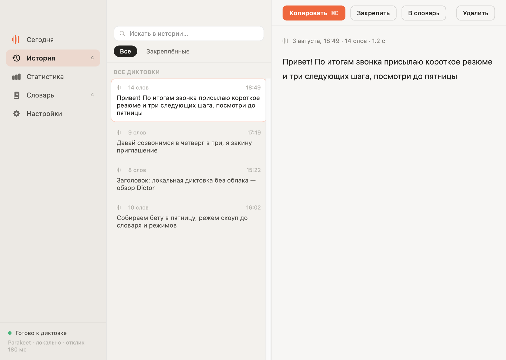
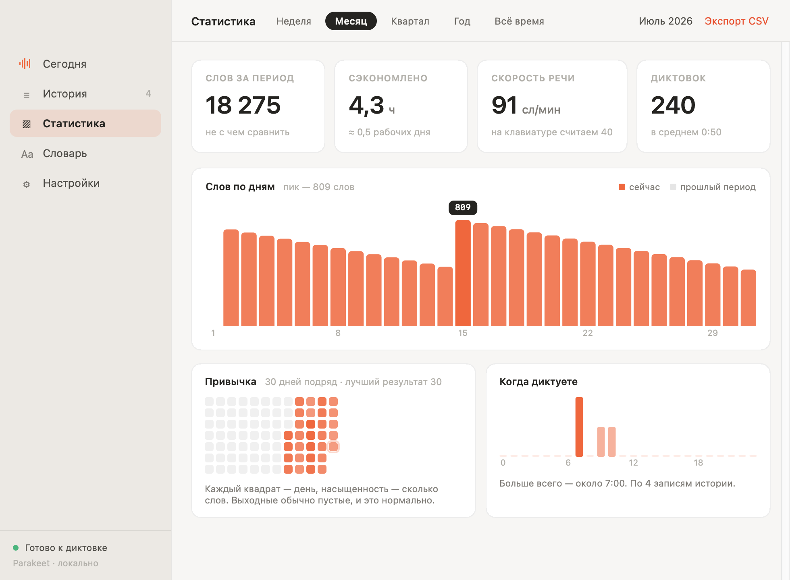
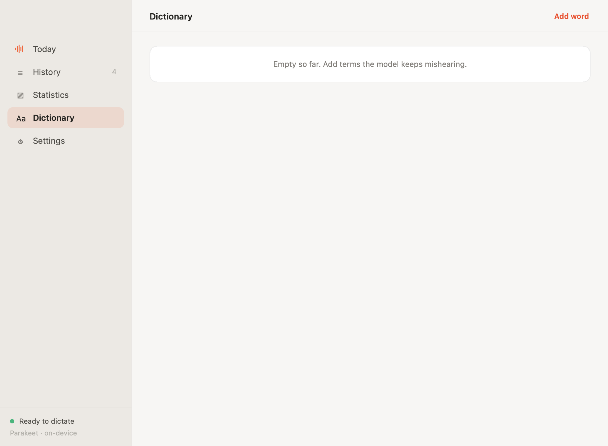
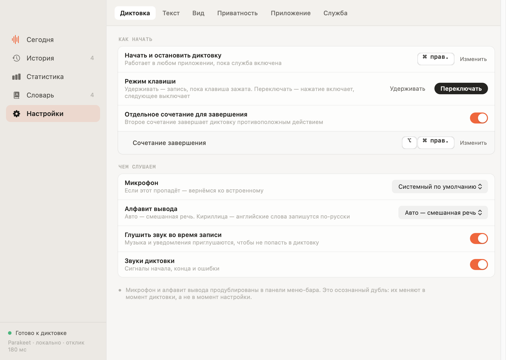
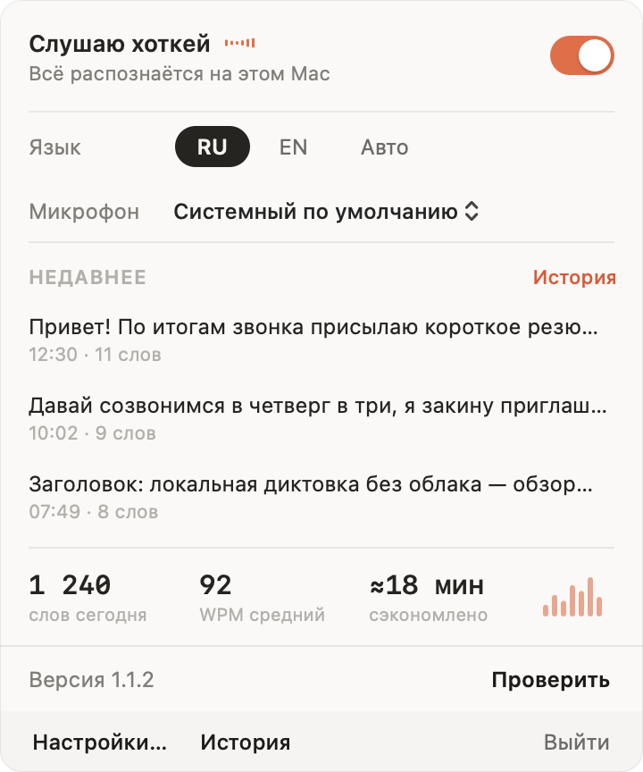
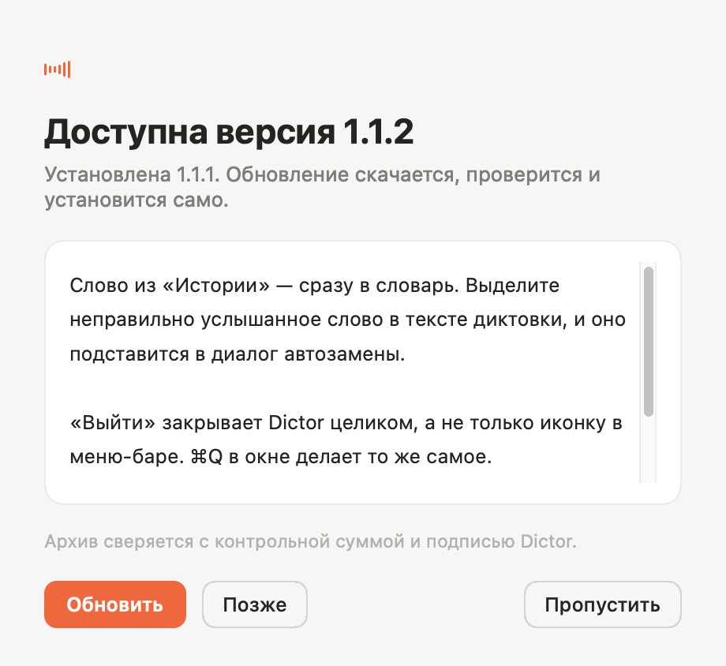
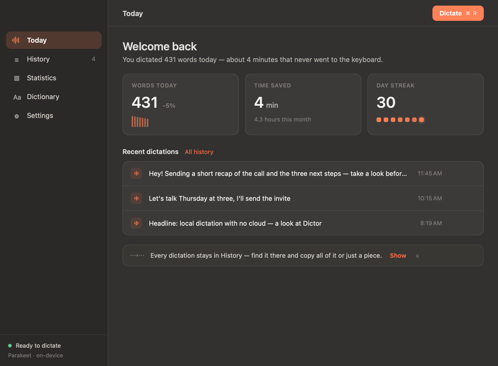

<div align="center">

# Dictor

**Диктовка для macOS, которая не отправляет ваш голос никуда.**

Нажали клавишу, сказали, отпустили — текст появился там, где стоит курсор.
Распознавание идёт на Apple Neural Engine, прямо на Mac. Без аккаунта, без
подписки, без облака, работает в самолёте.

[](https://github.com/abra9987/Dictor/actions/workflows/build.yml)
[](https://dictor.raulgumerov.com/)


</div>

## Зачем

Приложения для диктовки просят доверить компании свой голос. Большинство
отправляет каждую запись на сервер, берёт деньги помесячно и перестаёт работать
без интернета — ради того, что Mac умеет сам.

Dictor делает это на машине. Аудио её не покидает и удаляется, как только текст
готов. Интернет нужен дважды: один раз скачать модель распознавания и раз в
шесть часов спросить один-единственный номер — не вышла ли новая версия.
Выключите проверку — и приложение не ходит в сеть вовсе.

|  | Dictor | Облачная диктовка | Встроенная в macOS |
|---|---|---|---|
| Аудио покидает Mac | никогда | каждая запись | для части языков |
| Работает без интернета | да | нет | ограниченно |
| Стоимость | нет | помесячно | нет |
| История с поиском | 10 000 диктовок | по-разному | нет |
| Свой словарь | да | обычно | нет |
| Русский, английский и ещё 16 | да | да | да |

## Как выглядит

**Сегодня** — день целиком и последние диктовки.



<details>
<summary>Остальные экраны</summary>

**История** — три колонки: поиск по всему архиву, результаты с подсветкой
совпадений, полный текст с копированием и закреплением.



**Статистика** — периоды, сравнение с прошлым, календарь привычки, время суток,
кварталы и выгрузка в CSV.



**Словарь** — свои автозамены поверх двух встроенных наборов.



**Настройки** — семь вкладок внутри окна, без отдельных панелей.



**Панель меню-бара** — состояние службы, алфавит вывода, микрофон, последние
диктовки и статистика дня.



**Окно обновления** — что нового, загрузка, проверка и установка в один клик.



**Тёмная тема** — везде.



</details>

## Что умеет

- **Одна клавиша, любое приложение.** Удерживайте сочетание в сообщении, письме,
  редакторе кода — текст встанет под курсор. Удержание или переключение, на
  выбор.
- **Распознавание на устройстве.** NVIDIA Parakeet TDT v3 через CoreML на Apple
  Neural Engine: около полусекунды обработки на полминуты речи.
- **Русский и английский сразу**, плюс ещё 16 языков, с автоопределением.
- **История, отвечающая на вопрос «что я сказал?»** — до 10 000 диктовок, поиск
  с подсветкой совпадений.
- **Свой словарь** — поправьте слово, которое модель слышит не так, один раз, и
  оно останется поправленным. Добавлять можно прямо из своих расшифровок.
- **Удаление слов-паразитов** — «эээ» и «ммм» до текста не доходят.
- **Статистика, которая сообщает, а не воспитывает.**
- **Обновляется само** со своего канала, проверяя загрузку по SHA-256 и по
  подписи, прежде чем что-то заменить.

## Установка

Скачайте образ с **[dictor.raulgumerov.com](https://dictor.raulgumerov.com/)** и
перетащите Dictor в «Программы».

> **Запускайте из «Программ», а не с образа.** Приложение, открытое прямо с
> `.dmg` под карантином, macOS выполняет из одноразовой копии — и разрешения,
> выданные этой копии, исчезают вместе с ней. Dictor это замечает и предлагает
> перенести себя, но проще сразу перетащить.

Приложение подписано, но не нотаризовано, поэтому при первом запуске macOS
скажет, что не может проверить разработчика: **Системные настройки →
Конфиденциальность и безопасность → «Открыть всё равно»**. Обновления такого
предупреждения не показывают — они заменяют уже доверенное приложение.

Нужен macOS 14 и Apple Silicon.

## Приватность

- Аудио живёт на диске только как страховочный журнал на время обработки
  диктовки и удаляется, как только готов текст. При сбое журнал остаётся —
  следующий запуск вернёт диктовку в «Историю».
- Расшифровки и статистика остаются на вашем Mac.
- Ни аккаунтов, ни аналитики, ни отчётов о сбоях, ни каких-либо идентификаторов.
- Сетевых адресатов два: huggingface.co, откуда приходит модель (один раз — и
  повторно, только если кэш не пройдёт проверку целостности), и канал
  обновлений — номер версии и, при установке, архив. Проверку обновлений можно
  выключить.

## Сборка

Нужны только Xcode Command Line Tools.

```bash
./scripts/build-app.sh        # → dist/Dictor.app
./scripts/make-dmg.sh         # → dist/Dictor-<версия>.dmg
```

Перед коммитом:

```bash
./scripts/check.sh
swift build --package-path swift            # check.sh не компилирует
swift/.build/debug/Dictor --self-test all
```

Каждый экран проверяется рендером, а не на глаз — приложение снимает себя само,
в светлой и тёмной теме:

```bash
swift/.build/debug/Dictor --export-settings-preview   <dir>          # 14 PNG
swift/.build/debug/Dictor --export-history-preview    <dir> [ru|en]
swift/.build/debug/Dictor --export-onboarding-preview <dir>
swift/.build/debug/Dictor --export-popover-preview    <dir> [ru|en]
swift/.build/debug/Dictor --export-update-preview     <dir>
swift/.build/debug/Dictor --export-status-preview     <dir>
swift/.build/debug/Dictor --export-capsule-preview    <dir> [ru|en]
swift/.build/debug/Dictor --export-hud-animation      <dir> [ru|en]
```

Выпуск — `./scripts/make-release.sh --notes "…"` из чистого дерева: скрипт
соберёт приложение, образ и архив, проверит подпись тем же требованием, что и
апдейтер, выложит на канал, скачает обратно и сверит контрольную сумму,
поставит тег. `--dry-run` собирает и останавливается, `--site-only` обновляет
только страницу, не трогая уже выложенный релиз.

Как всё устроено внутри — [ARCHITECTURE.md](ARCHITECTURE.md). Канал обновлений —
[docs/updates.md](docs/updates.md). История версий —
[CHANGELOG.md](CHANGELOG.md). Что нужно знать, прежде чем присылать
изменения, — [CONTRIBUTING.md](CONTRIBUTING.md).

## Благодарности

Основано на открытом проекте Richard Courtman под лицензией MIT — атрибуция в
[LICENSE](LICENSE) и [NOTICE.md](NOTICE.md). Распознавание —
[FluidAudio](https://github.com/FluidInference/FluidAudio) и модель NVIDIA
Parakeet TDT.
